# 在线考试系统

### 完整项目获取

通过网盘分享的文件：考试系统

链接: https://pan.baidu.com/s/1oZ1Yu-PF3LIY1Hhz02oFfQ?pwd=aq3v 提取码: aq3v --来自百度网盘超级会员v3的分享

通过网盘分享的文件：工具包

链接: https://pan.baidu.com/s/1YmdoJvkjoUjA75wvHLDZ6A?pwd=xm96 提取码: xm96
--来自百度网盘超级会员v3的分享

需要远程项目部署或项目修改和毕业设计也可联系（添加申请时请备注好来意）

通过网盘分享的文件：远程调试部署联系方式

链接: https://pan.baidu.com/s/1W0dDcoZmayG0c7USJDYBYg?pwd=nqd7 提取码: nqd7
--来自百度网盘超级会员v3的分享

### 项目合集(项目不断更新中)
链接: https://pan.baidu.com/s/1nY-zhvAK0CXYcn3g7LzQnQ?pwd=id3c 提取码: id3c
--来自百度网盘超级会员v3的分享

#### 这些项目一起发你了 可以分享给你需要的同学 调试可找我 也接二次修改和项目定制、毕业设计等

## 接毕业设计和论文

微信联系方式：xzxj0206  QQ：3808981644   (支持修改、 部署调试、 支持代做毕设)

接网站建设、小程序、H5、APP、各种系统等，单片机、嵌入式也可以做

选题+开题报告+任务书+程序定制+安装调试+论文+答辩ppt  都可以做

## 一、介绍
Spring Boot+Vue前后端分离的在线考试系统

功能需求

(1)考试管理模块

管理员和教师登录系统后点击考试管理模块可以对所有考试进行查询，并且进行添加考试，添加考试可以通过添加试卷名称，试卷介绍，所属学院，所属专业，年级，考试日期，持续时间，总分，考试类型，考生提示等信息。

(2)题库管理模块

管理员和教师登录系统后，可以查询所有题库，并且增加题库，选择题型，难度，试题解析等。

(3)成绩查询模块

管理员和教师登录系统后可以查看所有学生的考试成绩，和分段成绩查询。

(4)学生管理模块

管理员和教师登录系统后可以对系统内的所有学生信息进行编辑，删除，添加等操作。

(5)教师管理模块

该模块只针对管理员开放，管理员通过对教师进行编辑，删除，添加等操作。

(6)试卷模块

学生登录系统后通过我的试卷模块进行在线考试，通过管理员和教师登录系统后台进行添加试卷，学生可以通过系统进行在线考试，考试结束后，会自动算出分数。

(7)练习模块

学生登录系统后，通过练习模块对所有题库内的试卷进行考试模拟练习，练习结束后系统会自动算出分数

(8)分数模块

学生登录系统后，通过查看自己所参加的练习和考试部分，进行分数查询。

## 二、前后端分离项目

### 后端

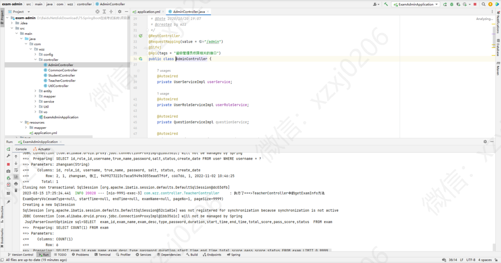

### 前端

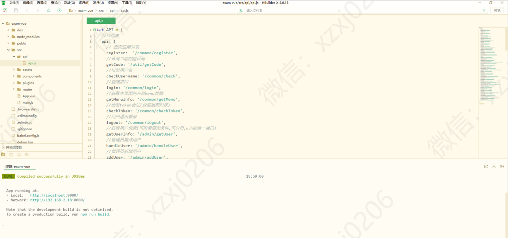

## 三、管理员部分页面展示

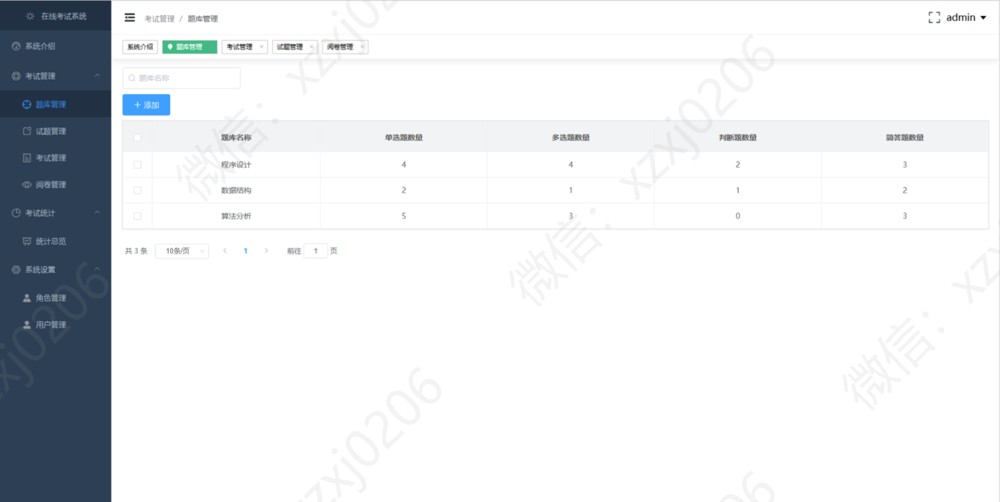

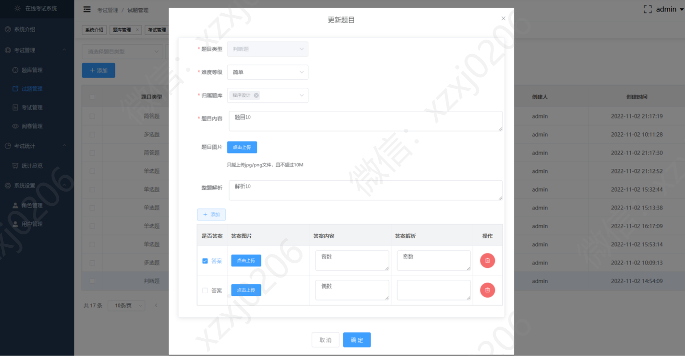

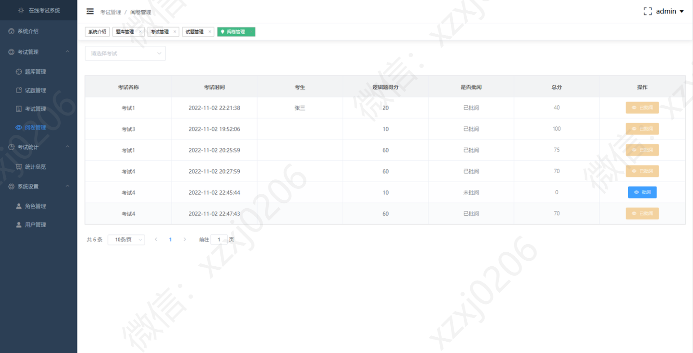

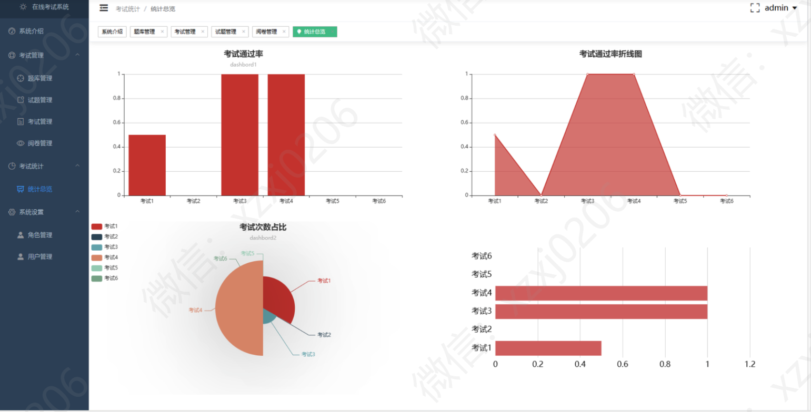

## 四、教师部分页面展示

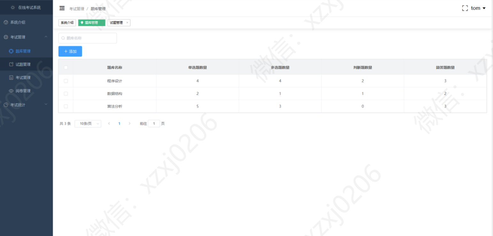

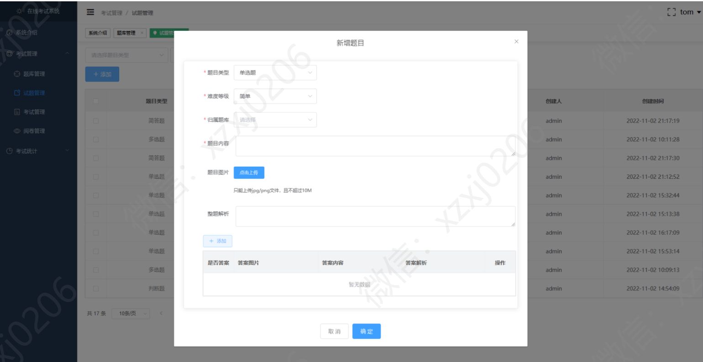

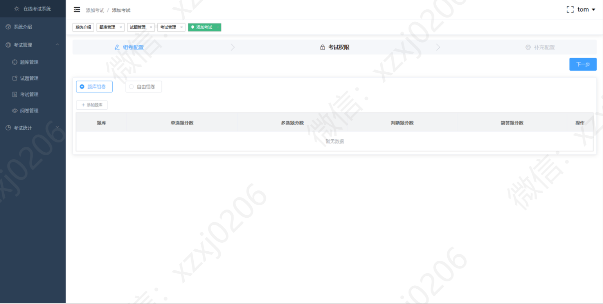

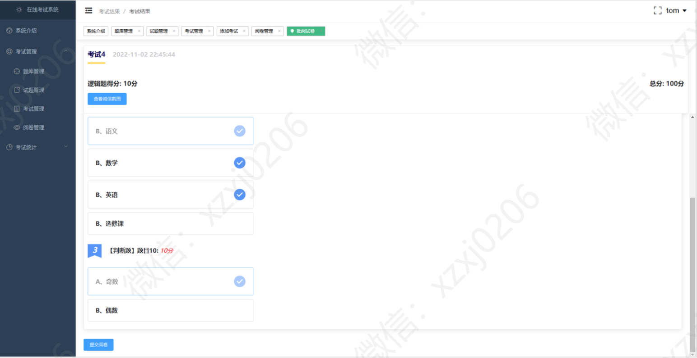

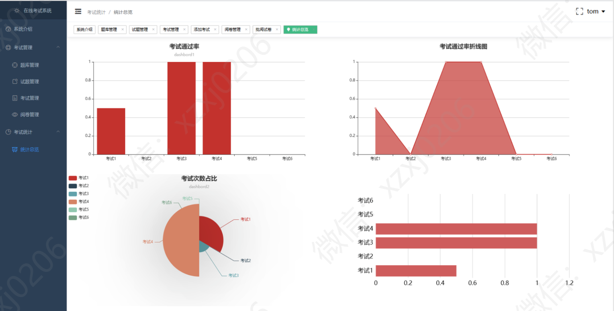

## 五、学生部分页面展示

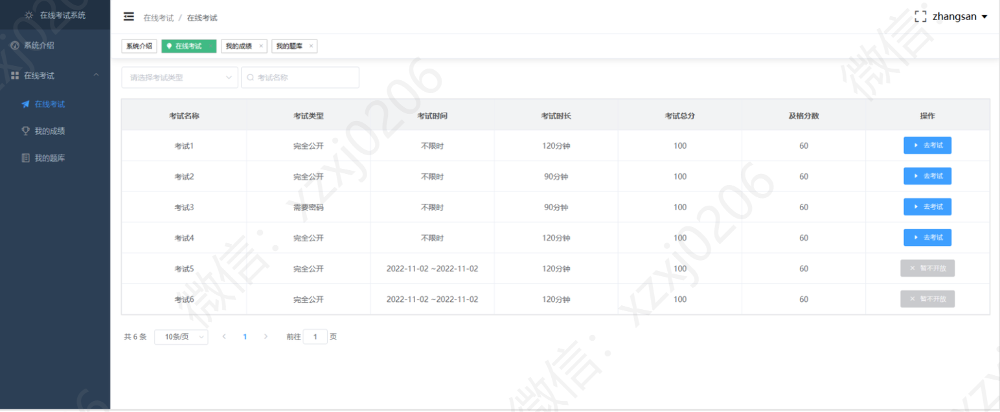

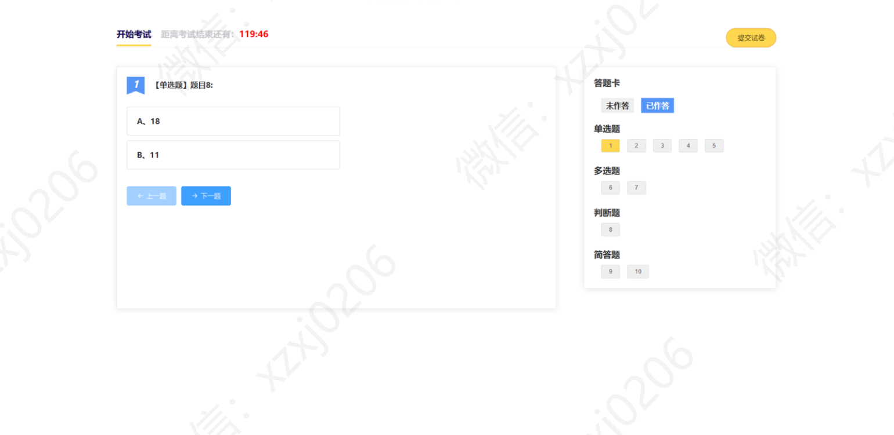

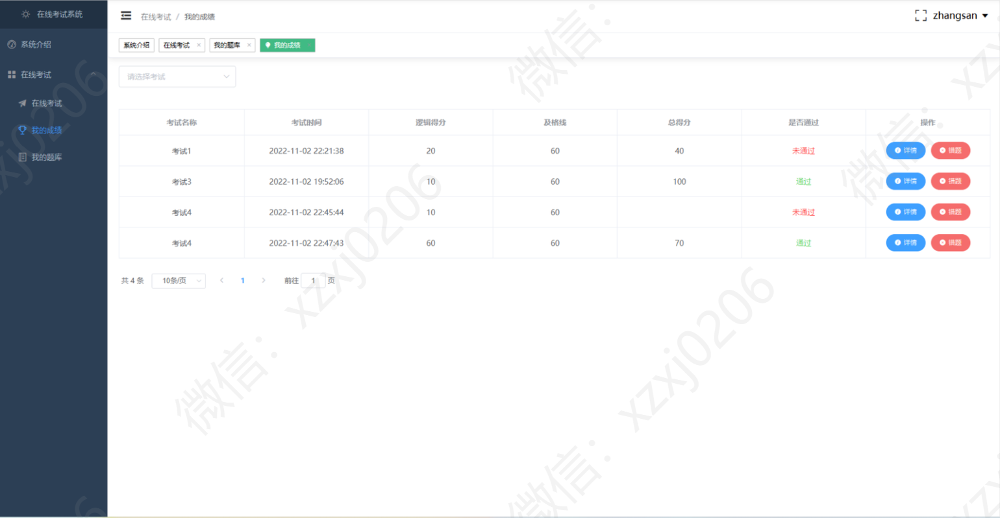

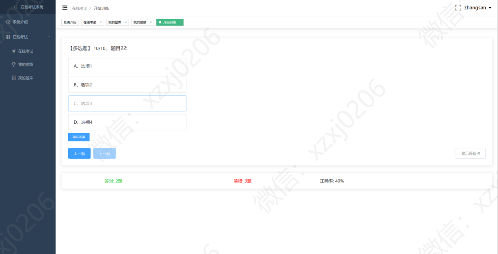

